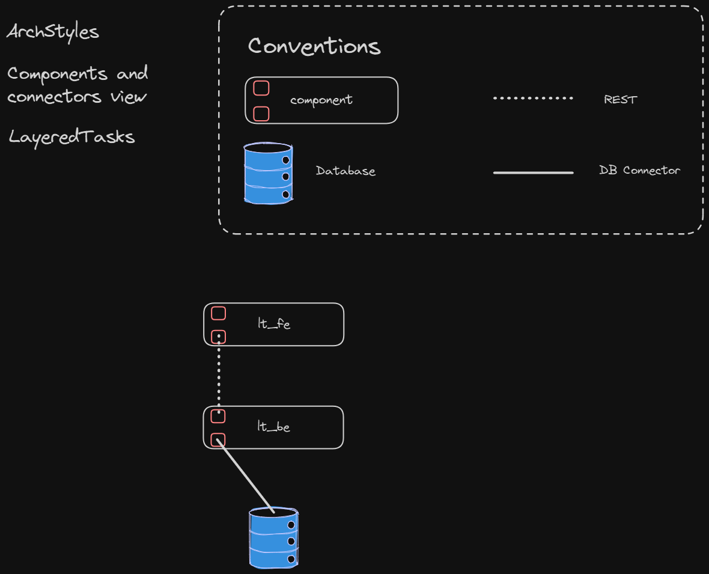

# LayeredTasks

**LayeredTasks** es una aplicación de gestión de tareas que sigue la arquitectura en capas (Layered Architecture). Este proyecto está diseñado para proporcionar una solución organizada para la gestión de tareas, permitiendo a los usuarios crear, organizar y monitorear sus tareas de manera efectiva. Acceda a la interfaz de usuario en `localhost:4200`

### Arquitectura en Capas

La arquitectura en capas organiza la aplicación en diferentes capas técnicas, cada una con responsabilidades bien definidas. Para más información sobre este estilo consulte [ClassNotes](https://feliperojas2601.github.io/ClassNotesWeb/books/).

#### Descripción de las Capas

1. **Capa de Presentación (Frontend)**:
   - **Angular**: Responsable de la interfaz de usuario, esta capa permite a los usuarios interactuar con el sistema, visualizar sus tareas, crear nuevas, actualizarlas, eliminarlas y filtrarlas según etiquetas, prioridades y estados. Es la capa que se comunica directamente con los usuarios y envía las solicitudes al backend.

2. **Capa de Aplicación (Backend)**:
   - **NestJS**: Implementa la lógica de negocio de la aplicación y expone una API RESTful que interactúa con la base de datos. Esta capa maneja las solicitudes del frontend, realiza validaciones y ejecuta las operaciones CRUD para usuarios, tareas y etiquetas. Además, gestiona la lógica relacionada con las prioridades y estados de las tareas.

3. **Capa de Datos (Base de Datos)**:
   - **PostgreSQL**: Esta capa es responsable de la persistencia de datos, almacenando toda la información relacionada con los usuarios, tareas, etiquetas y otros datos relevantes para la aplicación. Solo es accesible a través de la capa de aplicación, asegurando una separación clara de responsabilidades.

### Funcionalidades Básicas

- **Tareas**: CRUD (Crear, Leer, Actualizar, Eliminar) de tareas.