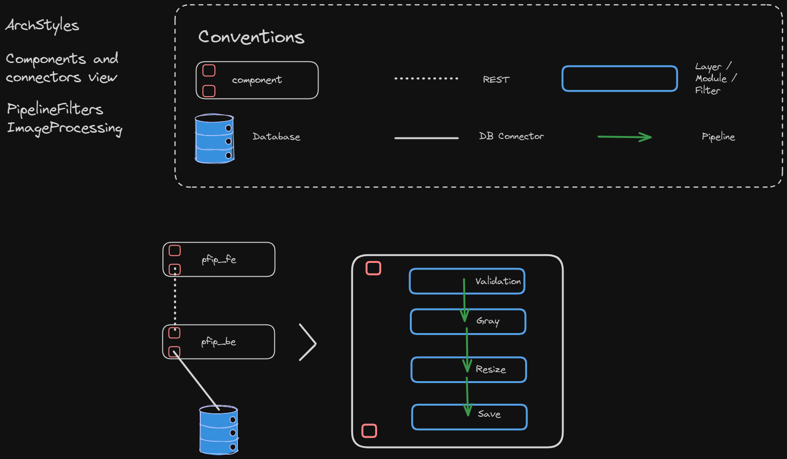

# PipelineFiltersImageProcessing

**PipelineFiltersImageProcessing** es una aplicación de procesamiento de imágenes que sigue la arquitectura **Pipeline and Filters** dentro de su capa de aplicación. Este proyecto está diseñado para aplicar una serie de transformaciones sobre imágenes de manera modular y escalable. Acceda a la interfaz de usuario en `localhost:4200` (si aplica).

### Arquitectura Pipeline and Filters

La arquitectura **Pipeline and Filters** se implementa dentro de la capa de aplicación del backend, permitiendo que las imágenes pasen a través de una serie de filtros, cada uno con una responsabilidad bien definida. Para más información sobre este estilo consulte [ClassNotes](https://feliperojas2601.github.io/ClassNotesWeb/books/).

#### Descripción del Pipeline

1. **Step 1**: Validación de la imagen.
2. **Step 2**: Aplicar filtro de escala de grises.
3. **Step 3**: Redimensionamiento de la imagen.
4. **Step 4**: Guardado de la imagen procesada.

### Stack Tecnológico

- **Frontend**: Angular.
- **Backend**: NestJS implementando Pipeline and Filters.
- **Base de Datos**: PostgreSQL.

### Funcionalidades Básicas

- **Procesamiento de Imágenes**: Aplicación de filtros a imágenes cargadas.